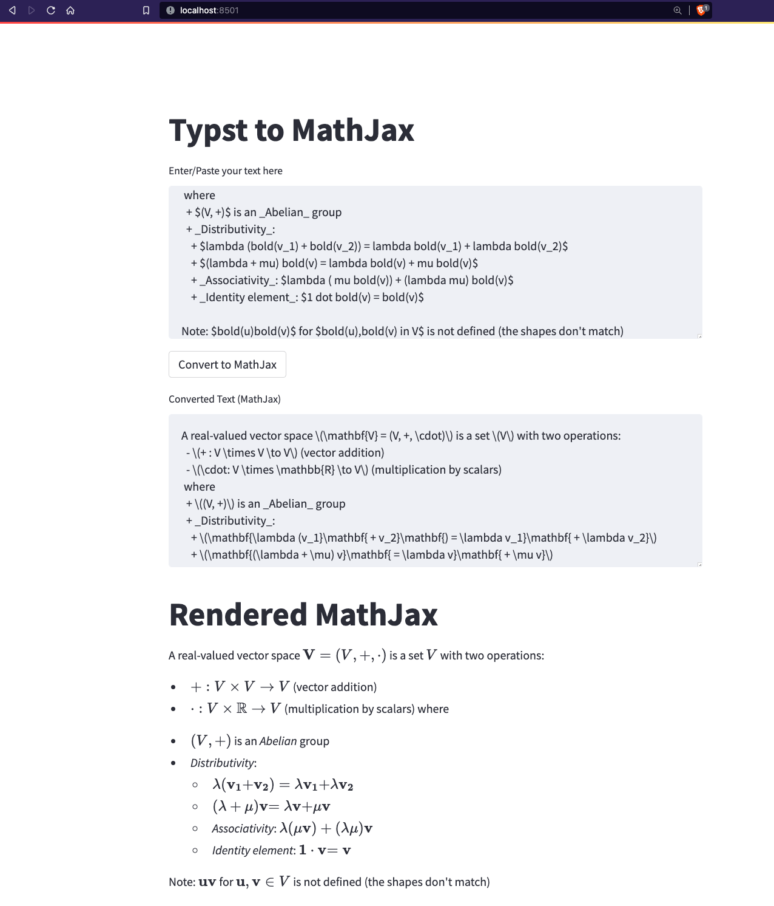

# Typst2MathJax

A simple [streamlit](https://streamlit.io/) app that converts [typst](https://typst.app/docs) to [mathjax](https://www.mathjax.org/).

## Use the app

Web app available [here](https://albanie-typst2mathjax-main-dgpnp0.streamlit.app/).

You can also run the app locally via:

```bash
streamlit run main.py
```

Looks like this:



## Testing

```bash
python -m unittest test.py
```

## Notes

This is a minimalist tool that I use to help with conversion. It uses a (very) lightweight parsing process that will likely fail on complex uses of Typst.